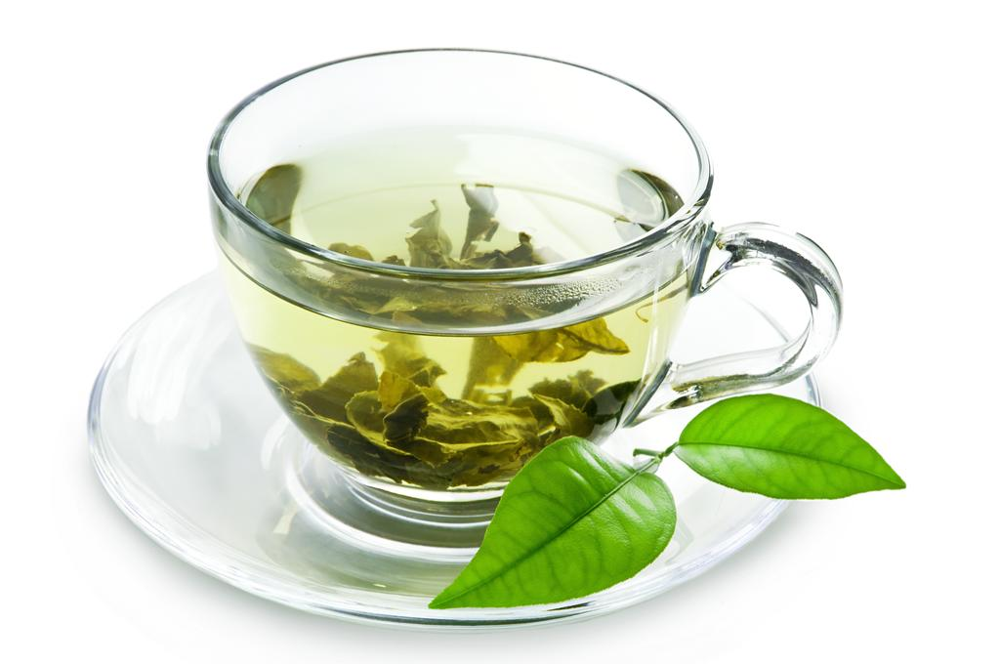
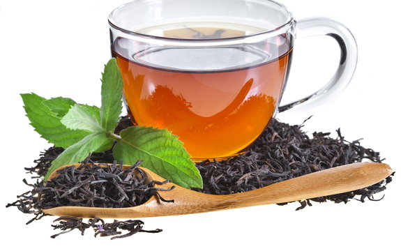
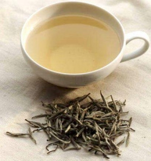
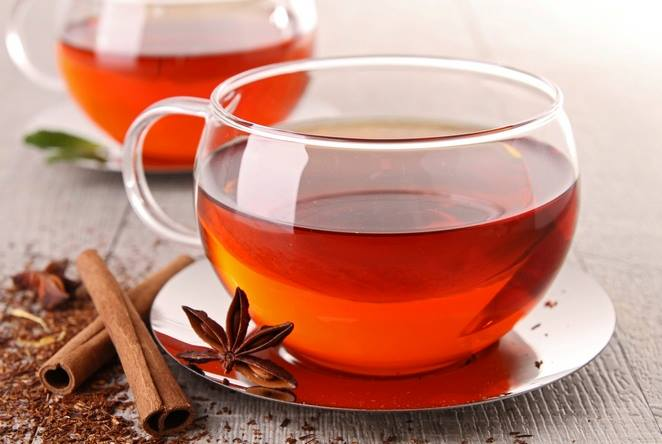

# Rodzaje herbat i sposoby parzenia:

## 1. Herbata zielona
*(chiński: 綠茶; lǜ chá)*

**Sposób parzenia**: zieloną herbatę zalewamy wodą o temperaturze od 60 do 90 stopni Celsjusza (wrząca woda po 3-4 minutach od zagotowania ma 90 stopni Celsjusza, a po 12-14 minutach ok.70-75 stopni Celsjusza). Czas parzenia uzależniony jest od stopnia rozdrobnienia suszu. Herbaty bardzo rozdrobnione parzymy krótko (ok.3minut), a te o dużych liściach parzymy znacznie dłużej. Herbatę ziolona możemy parzyć trzykrotnie.

## 2. Herbata czarna
*(chiński: 紅茶; hong chá)*

Czarne herbaty pochodzące z licznych plantacji indyjskich, chińskich i afrykańskich. Szczególnie wyjątkowa herbata pochodzi z Darjeeling, okręgu w północnych Indiach. Znane i cenione są również herbaty pochodzące z indyjskiej prowincji Assam oraz z Cejlonu (Sri Lanka).

**Właściwości:**

* koi duszę, rozjaśniania umysł (zawiera kofeinę, zwaną teiną )
* teina wzmaga aktywność soków trawiennych;

Otrzymuje się ją z prawie każdego rodzaju herbaty zielonej, poprzez poddanie jej procesowi pełnej fermentacji, co powoduje zmianę zabarwienia listków na brązowo. Jednoczesnej przemianie ulegają wszystkie składniki herbaty. Fermentacja powoduje, że garbniki zamieniają się w związki aromatyczne, zmniejsza się udział witaminy C oraz niektórych związków mineralnych.

Obróbka czarnej herbaty ma zawsze cztery podstawowe etapy: więdnięcie, zwijanie, fermentowanie (utlenianie) i suszenie (”palenie”).

**Sposób parzenia**: czas parzenia uzależniony jest uzależniony od stopnia rozdrobnienia suszu, gatunku herbaty. Średni czas parzenia wynosi 3-4 minuty.

## 3. Herbata biała
*(chiński: 白茶; bái chá)*

**Sposób parzenia**: białą herbatę parzymy ok. 5minut w temperaturze od 85-90 stopni Celsjusza. Białą herbatę możemy parzyć trzykrotnie.

## 4. Herbata czerwona
*(chiński: 黑茶, hei chá)*

**Sposób parzenia**: czerwoną herbatę parzymy w temperaturze 90 stopni Celsjusza przez ok. 3-7minut.
