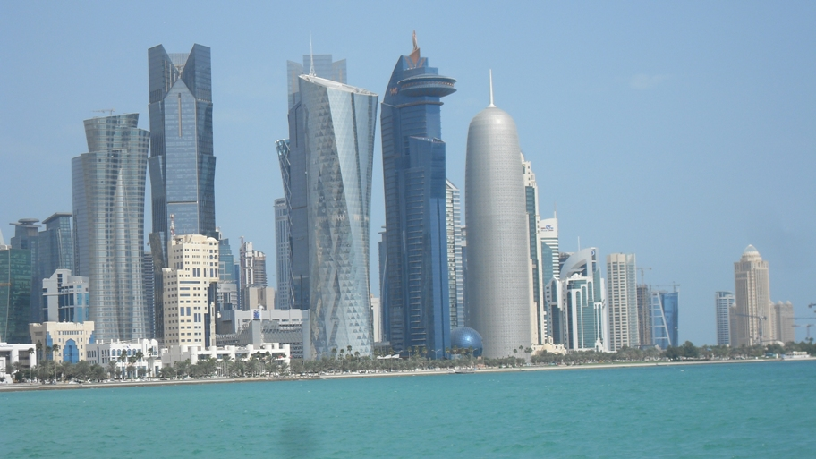
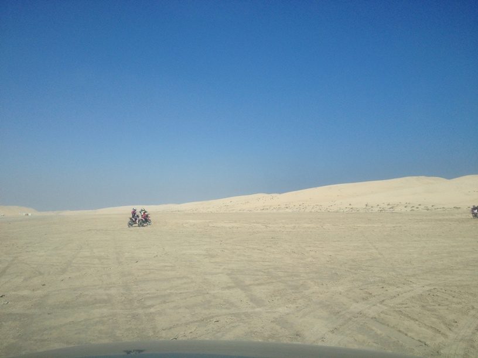
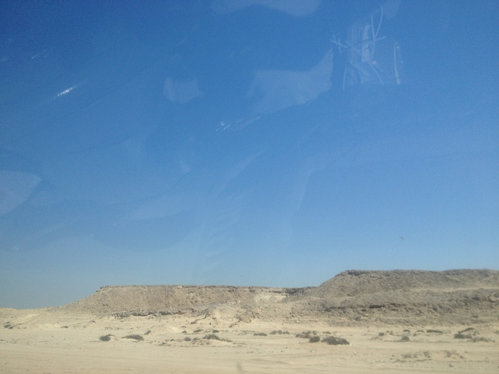
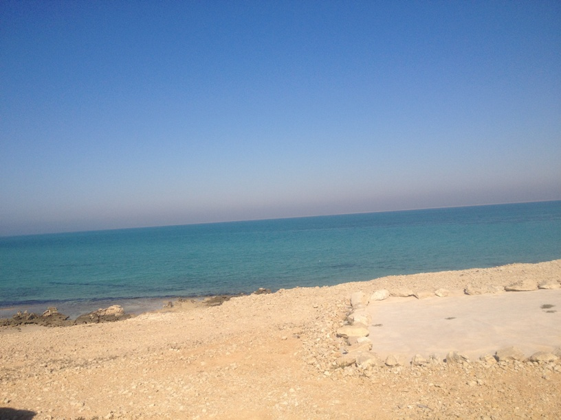

= Technologie Internetowe
A. Gisko

http://agisko.github.io/index.html[Kaligrafia chinska] - strona domowa o sztuce kaligrafii.

http://agisko.github.io/herbaty/herbaty.md[Herbaty chinskie] - dokument w formacie markdown.

== Zadania na egzamin z programowania
NOTE: Zadanie 1: Napisz program, ktory bedzie symulowal losowanie Toto Lotka.

Rozwiazanie:
 
--------------------------------------
#include <stdlib.h>
#include <stdio.h>
void main()
{
   int i, j, flaga, tablica[6];
   i = 0;
   j = 0;
   while(i < 6)
   { 
      srand(time(NULL));
      tablica[i] = rand() % 49 + 1;
      flaga = 0;
      for(j = 0; j < i; j++)
      {
         if(tablica[i] == tablica[j])
         { 
            flaga = 1;
            j = i;
         }
      }
      if(flaga == 0)
      {
         i++;
      }
   }   
   for(i = 0; i < 6; i++)
   {
      printf("%d\n", tablica[i]);
   }
}
--------------------------------------

 
== Prezentacja

Krajobrazy Kataru

* Stolica

* Pustynia na poludniu kraju

* Polnocna czesc kraju

* Zatoka Perska

